## Bioinformatics

::: callout-important
## Application of statistics and computer science to genomic/biological data.
:::

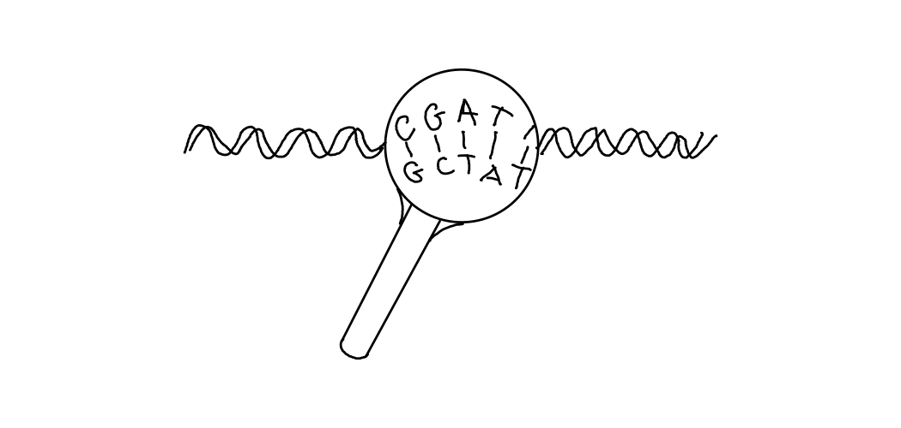

Purpose: decipher and manage genomic/biological information

## Key objectives of bioinformatics

1.  Genome sequencing & annotation
2.  Protein structure prediction
3.  Comparative genomics
4.  Transcriptomics and proteomics
5.  Drug discovery and design
6.  Metagenomics
7.  Systems biology
8.  Personalized medicine

::: notes
Genome Sequencing & Annotation – Deciphering DNA/RNA sequences and identifying genes.

Protein Structure Prediction – Modeling 3D protein structures to understand function.

Comparative Genomics – Studying evolutionary relationships by comparing genomes across species.

Transcriptomics & Proteomics – Analyzing gene expression (RNA) and protein interactions.

Drug Discovery & Design – Identifying drug targets and designing new therapeutics.

Metagenomics – Studying microbial communities (e.g., gut microbiome).

Systems Biology – Modeling complex biological networks (e.g., metabolic pathways).

Personalized Medicine – Using genomic data to tailor medical treatments.
:::

## Need for a separate scientific field

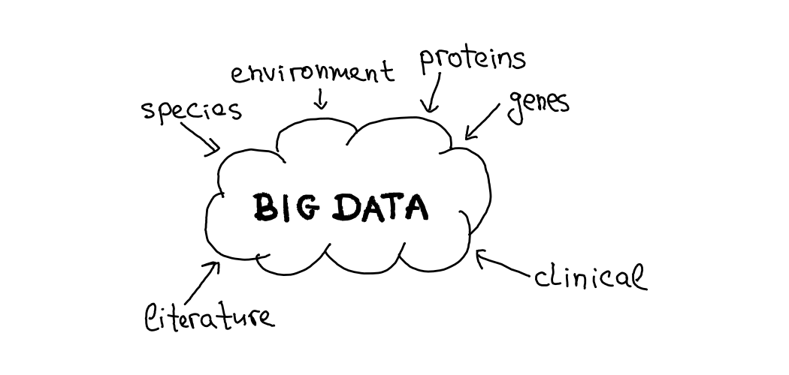

::: notes
also computational biology
:::

## Some famous applications

-   Human Genome Project
-   production of the mRNA vaccine vs Covid-19
-   gene cloning for the purposes of the pharmaceutical industry

## Structure of the lecture

1.  Theory - 45-50 min
2.  Practice - 45-50 min

# Theory

## Chromosomes, genes, alleles

::: r-stack
{.fragment}

{.fragment}
:::

## Homologs

Similar genes that have a shared ancestry.

## Orthologs

0 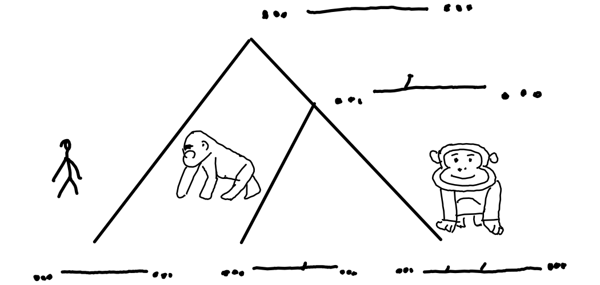

## Paralogs

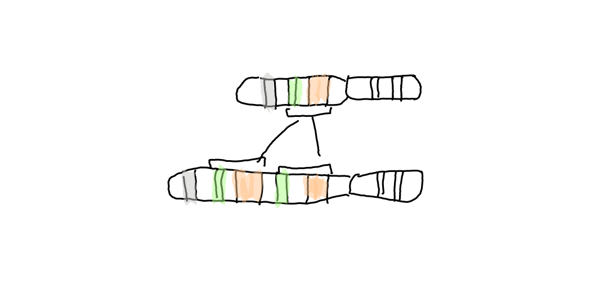

gene duplication

## Analogs

Genes that are similar due to convergent evolution, and not due to shared ancestry.

## Central dogma of molecular biology

DNA → RNA → protein

## Central dogma of molecular biology

~~DNA → RNA → protein~~ stated by @watson1970molecular.

::: callout-important
Watson is a known [racist](https://www.independent.co.uk/news/science/james-watson-racism-sexism-dna-race-intelligence-genetics-double-helix-a8725556.html):

-   "their intelligence is \[not really\] the same as ours"(referring to blacks)
-   "some anti-Semitism is justified"
-   having more women in science is "more fun" but "less effective"
:::

-   received Nobel prize together with Crick for work that was in major part done by **Rosalind Franklin**
-   Watson sold his Nobel prize in 2014 for \$4.1 million

## Central dogma of molecular biology

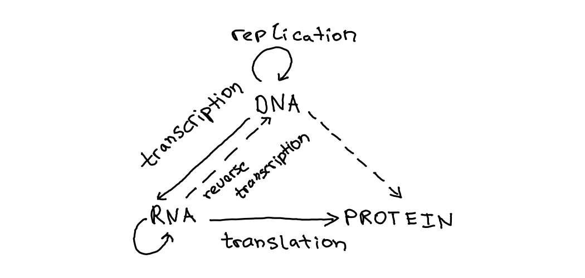

::: notes
Implications for the origin of life
:::

## Transcription

::: r-stack
{.fragment}

{.fragment}

{.fragment}

{.fragment}

{.fragment}

{.fragment}

{.fragment}
:::

## mRNA Processing

::: r-stack
{.fragment}

{.fragment}

{.fragment}
:::

## Alternative splicing A

::: r-stack


{.fragment}

{.fragment}
:::

## Alternative splicing B

::: r-stack


{.fragment}
:::

## Translation

::: r-stack


{.fragment}

{.fragment}
:::

## Translation video short from [YouTube](https://www.youtube.com/shorts/bfJjEoQOV1M)



## Codons


## Sequence variations

Nomenclature sensu @human2007nomenclature:

-   Mutations: disease causing
-   Polymorphisms: non-disease causing

Level:

-   genomic
-   RNA
-   protein
-   other

## Sequence variation types

-   Substitution: 76A\>C
-   Deletion: 76_78del
-   Insertion: 83_84insTG
-   indels, duplications, inversions, translocations, etc.

## Sequence alignment

Pair-wise alignment: compare two sequences.

```         
Seq1 5' ACTACTAGATTACTTACGGATCAGGTACTTTAGAGGCTTGCAACCA 3'
        |||||||||||    |||||||  |||||||||||||| |||||||
Seq2 5' ACTACTAGATT----ACGGATC--GTACTTTAGAGGCTAGCAACCA 3'
```

::: fragment
Multiple-sequence alignment: Seq1, Seq2, Seq3, ...
:::

## Global and local alignment

```         
Seq1 5' ACTACTAGATTACTTACGGATCAGGTACTTTAGAGGCTTGCAACCA 3'
        |||||||||||    |||||||  |||||||||||||| |||||||
Seq2 5' ACTACTAGATT----ACGGATC--GTACTTTAGAGGCTAGCAACCA 3'
```

::: fragment
global alignment: useful for aligning two closely related sequences, homologous genes
:::

::: fragment
```         
5' ACTACTAGATTACTTACGGATCAGGTACTTTAGAGGCTTGCAACCA 3'
                ||||| |||||| |||||||||||||||
             5' TTACTCACGGATGAGGTACTTTAGAGGC 3'
```

local alignment: divergent sequences, useful for finding out conserved patterns in DNA, gene families
:::

## Algorithms and tools for alignment

Global alignment uses the Needleman-Wunsch algorithm:

-   EMBOSS needle
-   specialized BLAST

Local alignment uses the Smith-Waterman algorithm:

-   BLAST
-   EMBOSS

## Genome assembly using a toy example

The sequencing machine returned the following reads:

`GTG, GCC, GCA, ATG, TGG, TGC, GGC, CGT, CAA, AAT`

In fact the actual sequence looks as follows:

`ATGGCGTGC`

## Using a Hamiltonian cycle

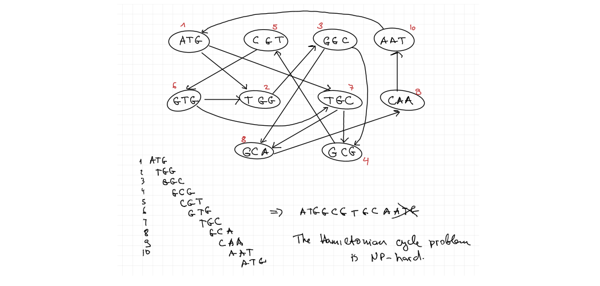

## Using a Eulerian cycle

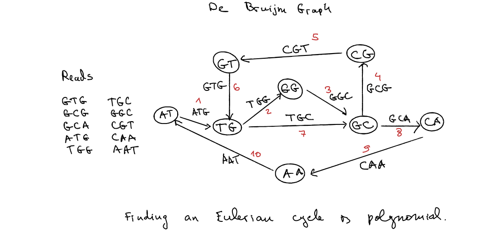

## Genome assembly

After @medvedev2021eulerian this is misleading.

-   you don't do a reconstruction of the reads: in real-world scenarios this is not unique
-   instead algorithms produce contigs: long segments of unambiguous segments
-   finding the set of all possible contigs is a polynomial-time problem (unitig algorithm), regardless of whether the genome is reconstructed as Hamiltonian or Eulerian cycle

## Main theorem (informal) @medvedev2021eulerian

The following problems are equivalent and solvable in linear time:

-   Find an Eulerian cycle in the de Bruijn graph where the edges correspond to k-mers in the reads.

-   Find a Hamiltonian cycle in the de Bruijn graph where the edges correspond to all the possible (k+1)-mers that can be obtained from the reads’ k-mers.

# Practical: Working with Genomic Data

## Some cat phenotypes

![Figure 1 [@lyons2015dna]: (a) wild type (b) non-*Agouti* allele (c) *Inhibitor* allele](images/10.1177_1098612x15571878-fig1.jpg){fig-align="center"}

## The task of the lecture

```         
ATGAATATCCTCCGCCTACTCCTGGCCACCCTGCTGGTCTGCCTGTGCCTCCTCACTGCCTACAGTCAC
CTGGCACCTGAGGAAAAACCCAGAGATGACAGGAACCTGAGGAGCAACTCCTCTGAACATGTTGGATCT
CTCTTCTGTCTCTATTGTAGCGCTGAACAAGAAATCCAAAAAGATCAGCAGAAAAGAGGCGGAAAAGAA
GAGATCTTCCAAGAAAAAGGCTTCGATGAAGAATGTTGCTCAGCCTCGGCGGCCCCGGCCTCCGCCGCC
CGCCCCCTGCGTGGCCACTCGTGACAGCTGCAAGCCGCCGGCGCCCGCCTGCTGCGACCCGTGCGCCTC
CTGCCAGTGCCGCTTCTTCCGCAGCTCCTGCTCCTGCCGAGTGCTCAACCCCACCTGCTGA
```

## Working with literature

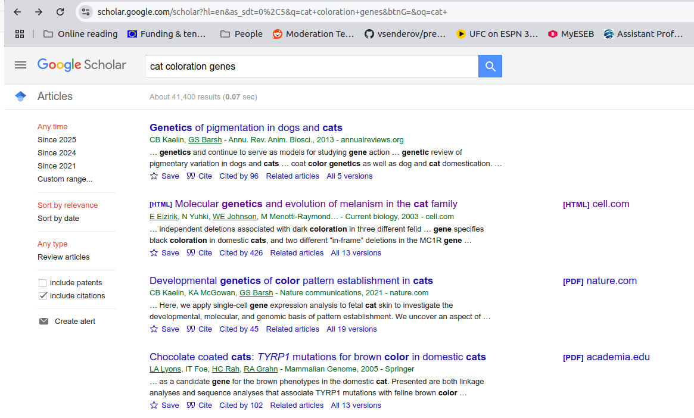

\[Google Scholar\](https://scholar.google.com)

::: notes
Investigating the *Agouti coloration genetics.* [@eizirik2003molecular]

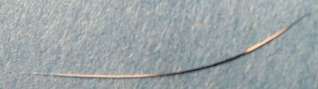

-   agouti protein → red/yellow pheomelanin
-   α-MSH → brown/black eumelanin
:::

## Genome browsers

> Genome browsers allow researchers to navigate the genome in an analogous way to navigating the internet [@furey2006comparison].

Provide

-   access to and
-   visualization of

of *genomic sequences* and *annotations*.

## Genome browsers

Popular genome browsers include:

-   [UCSC Genome Browser](https://genome.ucsc.edu/)

-   [Ensembl](http://www.ensembl.org/)

-   [NCBI](https://www.ncbi.nlm.nih.gov/)

## NCBI Nucleotide Database

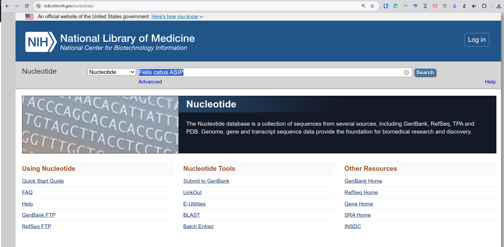

<https://www.ncbi.nlm.nih.gov/nucleotide/>

::: notes
Search for `Felis catus ASIP`

Expand `RefSeq Sequences`

Explain:

-   RefSeq - Reference sequence databases of the NCBI
-   accession number - unique identifiers for individual units of data
    -   NM - experimentally validated transcript
    -   NP - experimentally supported protein
    -   XM - computationally predicted transcript
    -   XP - computational translation of XM transcript

Expand NM_001009190.1
:::

## NCBI - 2 (mRNA transcript)

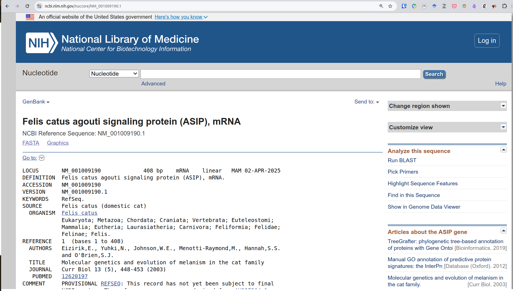

<https://www.ncbi.nlm.nih.gov/nuccore/NM_001009190.1>

<https://www.ncbi.nlm.nih.gov/nuccore/NM_000799.4> (UTR)

::: notes
Expand `NM_...`

Scroll to FEATURES

Click on gene

Click on CDS - coding sequence, no UTR - untranslated regions here

Click on the exons

Open Homo sapiens erythropoietin (EPO), mRNA

Illustrate UTR
:::

## NCBI - 3 (protein sequence)

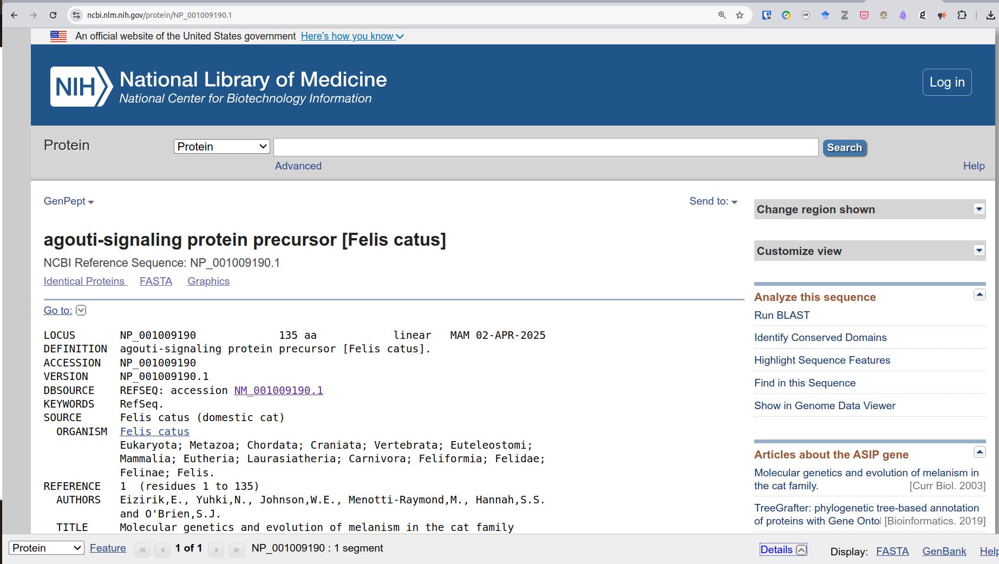

<https://www.ncbi.nlm.nih.gov/protein/NP_001009190.1>

::: notes
Now look at protein sequence `NP_...`

Note that it is a precursor because it has regulatory sequences (peptides and what not) that have to be removed post-translationally to release the active protein.
:::

## Download files

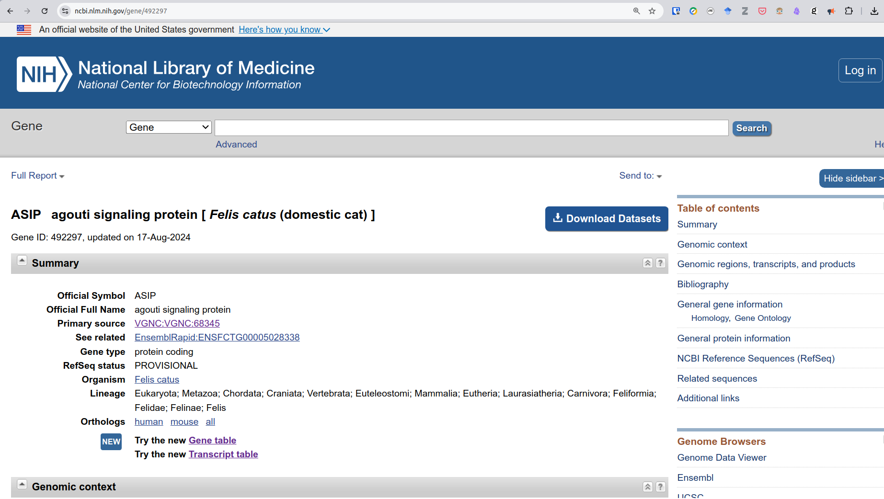

::: notes
Go back to the screen with the overview and click on ASIP, select all and download
:::

## A Note on Running Windows

[Tutorial on how to install WSL on Windows](https://documentation.ubuntu.com/wsl/en/stable/howto/install-ubuntu-wsl2/)

## Examining the files with UNIX CLI

```{=html}
<script src="https://asciinema.org/a/A8df6B2jsRXlopMVtjQ3O9ByF.js" id="asciicast-A8df6B2jsRXlopMVtjQ3O9ByF" async="true"></script>
```

::: notes
-   unzip - l ASIP_datasets.zip
-   verify md5 checksums
-   examine with a text editor, locate an entry of interest and copy it away
-   to select click 'v' to yank 'y', to paste 'p', movement between buffers 'bp', 'bn'
:::

## Examining the files with Aliview

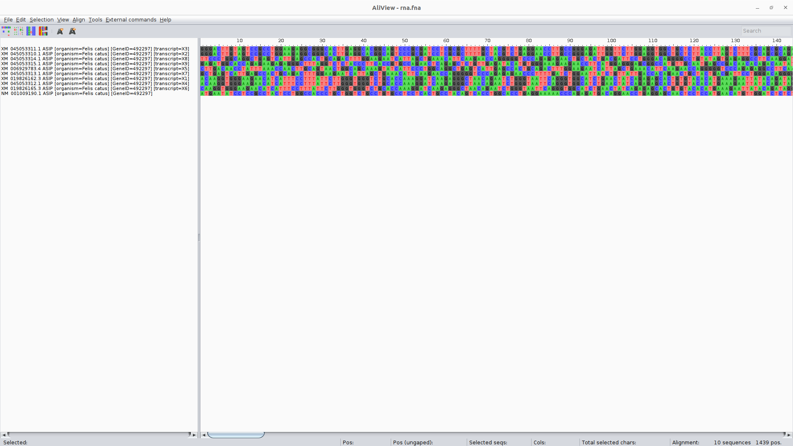

::: notes
-   Open mRNA in AliView
-   Highlight difference
-   show translation
-   open proteins, talk about differences to the translation
    -   go back to the NCBI viewer https://www.ncbi.nlm.nih.gov/nuccore/XM_045053310.1
    -   click on CDS
    -   realign curated and X2 using realign selected block
    -   set reading frame to 3
-   finally open gene
:::

## BLAST Search

Let's find out more information about:

```         
>c.122-123delCA [organism=Felis catus] [GeneID=492297] Non-agouti allele
ATGAATATCCTCCGCCTACTCCTGGCCACCCTGCTGGTCTGCCTGTGCCTCCTCACTGCCTACAGTCACC
TGGCACCTGAGGAAAAACCCAGAGATGACAGGAACCTGAGGAGCAACTCCTCTGAACATGTTGGATCTCT
CTTCTGTCTCTATTGTAGCGCTGAACAAGAAATCCAAAAAGATCAGCAGAAAAGAGGCGGAAAAGAAGAG
ATCTTCCAAGAAAAAGGCTTCGATGAAGAATGTTGCTCAGCCTCGGCGGCCCCGGCCTCCGCCGCCCGCC
CCCTGCGTGGCCACTCGTGACAGCTGCAAGCCGCCGGCGCCCGCCTGCTGCGACCCGTGCGCCTCCTGCC
AGTGCCGCTTCTTCCGCAGCTCCTGCTCCTGCCGAGTGCTCAACCCCACCTGCTGA
```

::: notes
-   open file *agouti mutation*
-   describe FASTA file format
    -   identifier
    -   mutation nomenclature
    -   modifiers
-   open <https://blast.ncbi.nlm.nih.gov/Blast.cgi>
-   search for sequence
:::

## Comparing the variant to the wild-type

-   deletion at position 123 and 124

-   refer to @lyons2015dna to infer absence of pands

::: notes
-   back in Aliview
-   open mutation
-   add and align selected sequences from file (agouti)
-   show the translation of the mutation, the stop codon comes earlier
:::

## More topics - Primer

[Primer blast](https://www.ncbi.nlm.nih.gov/tools/primer-blast/)

::: notes
-   take X2
-   look at the CDS range from the web and into forward and reverse primers
:::

## Project

You will be given a genetic sequence and you are to use the tools described today to determine what is the phenotype of the organism that it belongs to.

If you want to do the assignment, send me an email to

vsenderov\@gmail.com

## Further resources: Online

[Introduction to genome browsers using Ensembl (video)](https://www.youtube.com/watch?v=42qZyXSH0Cc)

[Data File Formats (UCSC FAQ)](https://genome.ucsc.edu/FAQ/FAQformat.html)

[FASTA Format for Nucleotide Sequences](https://www.ncbi.nlm.nih.gov/genbank/fastaformat/){.uri}

[Nomenclature for the description of mutations](https://www.hgmd.cf.ac.uk/docs/mut_nom.html){.uri}

[Recombinant DNA, Cloning, & Editing](https://www.youtube.com/watch?v=kVu37T6sB_E)

## Bibliography